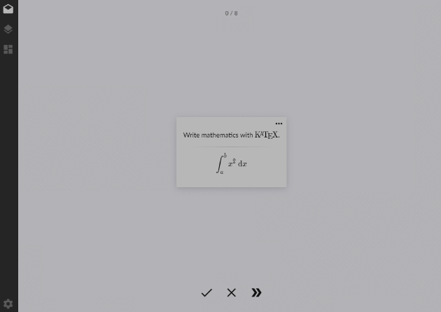
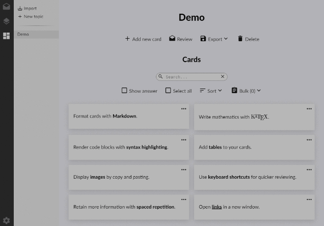

# Flash Cards - Web Application. 

Uses Flask (API in Python) for backend 
PostgreSQL for storing and managing data in the database.

## Features

* Create flashcards 
* Create todo list 
* Write notes
* Convert notes to pdf
* Rename notes and find text in notes
* Personalize time management tools

  
